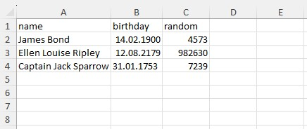
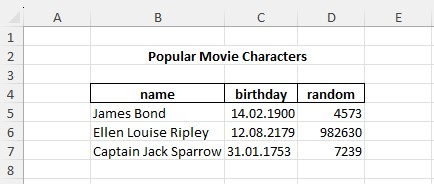

# FastExcelLaravel

Lightweight and very fast XLSX Excel Spreadsheet read/write library for Laravel in pure PHP
(wrapper around [FastExcelWriter](https://packagist.org/packages/avadim/fast-excel-writer) 
 and [FastExcelReader](https://packagist.org/packages/avadim/fast-excel-reader))

## Introduction

Exporting data from your Laravel application has never been so fast! Importing models into your Laravel application has never been so easy!

This library is a wrapper around **avadim/fast-excel-writer** and **avadim/fast-excel-reader**, so it's also lightweight, fast, and requires a minimum of memory.
Using this library, you can export arrays, collections and models to a XLSX-file from your Laravel application, and you can import data to Laravel application.

**Features**

* Writing
  * Easily export models, collections and arrays to Excel
  * Export huge datasets very fast, and using a minimum of memory
  * Сan create multiple sheets and supports basic column, row and cell styling
  * You can set the height of the rows and the width of the columns (including auto width calculation)
  * Mapping export data
  * You can add active hyperlinks, formulas, notes and images to output XLSX-files
  * Supports workbook and sheet protection with/without passwords
  * Supports page settings - page margins, page size
  * Inserting multiple charts
  * Supports data validations and conditional formatting
* Reading
  * Import workbooks and worksheets to Eloquent models very quickly and with minimal memory usage
  * Automatic field detection from imported table headers
  * Import huge files very fast, and using a minimum of memory
  * Mapping import data
  * Supports auto formatter and custom formatter of datetime values for import data
  * The library can define and extract images from XLSX files
* Mapping import/export data

## Installation

Install via composer:

```
composer require avadim/fast-excel-laravel
```
And then you can use facade ```Excel```

```php
// Create workbook...
$excel = \Excel::create();

// export model...
$excel->sheet()->withHeadings()->exportModel(Users::class);

// and save XLSX-file to default storage
$excel->saveTo('path/file.xlsx');

// or save file to specified disk
$excel->store('disk', 'path/file.xlsx');

// Open saved workbook
$excel = \Excel::open(storage_path('path/file.xlsx'));

// import records to database
$excel->withHeadings()->importModel(User::class);
```

Jump To:
* [Export Data](#export-data)
  * [Export a Model](#export-a-model)
  * [Export Any Collections and Arrays](#export-any-collections-and-arrays)
  * [Mapping Export Data](#mapping-export-data)
  * [Advanced Usage for Data Export](#advanced-usage-for-data-export)
* [Import Data](#import-data)
  * [Import a Model](#import-a-model)
  * [Mapping Import Data](#mapping-import-data)
  * [Advanced Usage for Data Import](#advanced-usage-for-data-import)
* [More Features](#more-features)
* [Do you want to support FastExcelLaravel?](#do-you-want-to-support-fastexcellaravel)
 

## Export Data

### Export a Model
Easy and fast export of a model. This way you export only model data without headers and without any styling 
```php

// Create workbook with sheet named 'Users'
$excel = \Excel::create('Users');

// Export all users to Excel file
$sheet->exportModel(Users::class);

$excel->saveTo('path/file.xlsx');
```
The following code will write the field names and styles (font and borders) to the first row, and then export all the data of the User model

```php

// Create workbook with sheet named 'Users'
$excel = \Excel::create('Users');

// Write users with field names in the first row
$sheet->withHeadings()
    ->applyFontStyleBold()
    ->applyBorder('thin')
    ->exportModel(Users::class);

$excel->saveTo('path/file.xlsx');
```

### Export Any Collections and Arrays
```php
// Create workbook with sheet named 'Users'
$excel = \Excel::create('Users');

$sheet = $excel->sheet();
// Get users as collection
$users = User::where('age', '>', 35)->get();

// Write attribute names
$sheet->writeRow(array_keys(User::getAttributes()));

// Write all selected records
$sheet->writeData($users);

$sheet = $excel->makeSheet('Records');
// Get collection of records using Query Builder
$records = \DB::table('users')->where('age', '>=', 21)->get(['id', 'name', 'birthday']);
$sheet->writeData($records);

$sheet = $excel->makeSheet('Collection');
// Make custom collection of arrays
$collection = collect([
    [ 'id' => 1, 'site' => 'google.com' ],
    [ 'id' => 2, 'site.com' => 'youtube.com' ],
]);
$sheet->writeData($collection);

$sheet = $excel->makeSheet('Array');
// Make array and write to sheet
$array = [
    [ 'id' => 1, 'name' => 'Helen' ],
    [ 'id' => 2, 'name' => 'Peter' ],
];
$sheet->writeData($array);

$sheet = $excel->makeSheet('Callback');
$sheet->writeData(function () {
    foreach (User::cursor() as $user) {
        yield $user;
    }
});

```

### Mapping Export Data

You can map the data that needs to be added as row

```php
$sheet = $excel->sheet();
$sheet->mapping(function($model) {
    return [
        'id' => $model->id, 'date' => $model->created_at, 'name' => $model->first_name . $model->last_name,
    ];
})->exportModel(User::class);
$excel->save($testFileName);

```

### Advanced Usage for Data Export

See detailed documentation for avadim/fast-excel-writer here: https://github.com/aVadim483/fast-excel-writer/tree/master#readme

```php
$excel = \Excel::create('Users');
$sheet = $excel->sheet();

// Set column B to 12
$sheet->setColWidth('B', 12);
// Set options for column C
$sheet->setColOptions('C', ['width' => 12, 'text-align' => 'center']);
// Set column width to auto
$sheet->setColWidth('D', 'auto');

$title = 'This is demo of avadim/fast-excel-laravel';
// Begin area for direct access to cells
$area = $sheet->beginArea();
$area->setValue('A2:D2', $title)
      ->applyFontSize(14)
      ->applyFontStyleBold()
      ->applyTextCenter();
      
// Write headers to area, column letters are case independent
$area
    ->setValue('a4:a5', '#')
    ->setValue('b4:b5', 'Number')
    ->setValue('c4:d4', 'Movie Character')
    ->setValue('c5', 'Birthday')
    ->setValue('d5', 'Name')
;

// Apply styles to headers
$area->withRange('a4:d5')
    ->applyBgColor('#ccc')
    ->applyFontStyleBold()
    ->applyOuterBorder('thin')
    ->applyInnerBorder('thick')
    ->applyTextCenter();
    
// Write area to sheet
$sheet->writeAreas();

// You can set value formats for some fields
$sheet->formatAttributes(['birthday' => '@date', 'number' => '@integer']);

// Write data to sheet
$sheet->writeData($data);

// Save XLSX-file
$excel->saveTo($testFileName);

```

## Import Data

### Import a Model
To import models, you can use method ```importModel()```. 
If the first row contains the names of the fields you can apply these using method ```withHeadings()``` 



```php
// Open XLSX-file 
$excel = Excel::open($file);

// Import a workbook to User model using the first row as attribute names
$excel->withHeadings()->importModel(User::class);

// Done!!!
```
You can define the columns or cells from which you will import

```php
// Import row to User model from columns range A:B - only 'name' and 'birthday'
$excel->withHeadings()->importModel(User::class, 'A:B');
```


```php
// Import from cells range
$excel->withHeadings()->importModel(User::class, 'B4:D7');

// Define top left cell only
$excel->withHeadings()->importModel(User::class, 'B4');
```
In the last two examples, we also assume that the first row of imported data (row 4) 
is the names of the attributes.

### Mapping Import Data

However, you can set the correspondence between columns and field names yourself.

```php
// Import row to User model from columns range B:E
$excel->mapping(function ($record) {
    return [
        'id' => $record['A'], 'name' => $record['B'], 'birthday' => $record['C'], 'random' => $record['D'],
    ];
})->importModel(User::class, 'B:D');

// Define top left cell only
$excel->mapping(['B' => 'name', 'C' => 'birthday', 'D' => 'random'])->importModel(User::class, 'B5');

// Define top left cell only (shorter way)
$excel->importModel(User::class, 'B5', ['B' => 'name', 'C' => 'birthday', 'D' => 'random']);
```

### Advanced Usage for Data Import
See detailed documentation for avadim/fast-excel-reader here: https://github.com/aVadim483/fast-excel-reader/tree/master#readme
```php
$excel = Excel::open($file);

$sheet = $excel->sheet('Articles');
$sheet->setReadArea('B5');
foreach ($sheet->nextRow() as $rowNum => $rowData) {
    $user = User::create([
        'name' => $rowData['B'],
        'birthday' => new \Carbon($rowData['C']),
        'password' => bcrypt($rowData['D']),
    ]);
    Article::create([
        'user_id' => $user->id,
        'title' => $rowData['E'],
        'date' => new \Carbon($rowData['F']),
        'public' => $rowData['G'] === 'yes',
    ]);
}
```

## More Features
You can see more features for export in the documentation for [FastExcelWriter](https://packagist.org/packages/avadim/fast-excel-writer).

You can see more features for import in the documentation for [FastExcelReader](https://packagist.org/packages/avadim/fast-excel-reader))

## Do you want to support FastExcelLaravel?

if you find this package useful you can support and donate to me for a cup of coffee:

* USDT (TRC20) TSsUFvJehQBJCKeYgNNR1cpswY6JZnbZK7
* USDT (ERC20) 0x5244519D65035aF868a010C2f68a086F473FC82b
* ETH 0x5244519D65035aF868a010C2f68a086F473FC82b 

Or just give me a star on GitHub :)
